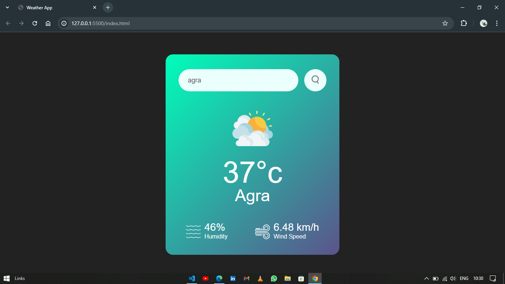
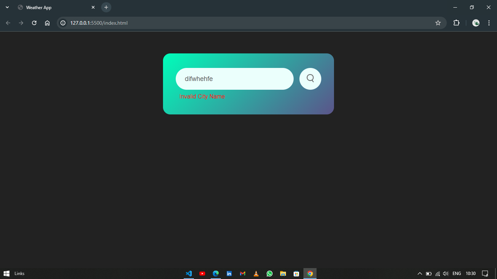

---

# Weather App

A simple web application that displays weather information based on user input.

## Motivation

I created this project to practice my HTML, CSS, and JavaScript skills. The goal was to build a user-friendly weather app that provides accurate weather data.

## Installation

1. Clone this repository:
   ```
   git clone https://github.com/PranjulUpadhyay/Weather-App.git
   ```

2. Open `index.html` in your preferred web browser.

## Usage

1. Enter a city name or ZIP code in the input field.
2. Click the "Get Weather" button.
3. The app will display the current weather conditions, temperature, and other relevant information.

## Screenshots

;
;

## Credits

- Weather data provided by [OpenWeatherMap](https://openweathermap.org/).

## License

This project is licensed under the MIT License - see the [LICENSE](LICENSE) file for details.

---
